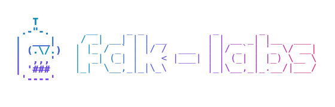

A shared toolbox of customisations that make AI coding agents smarter for everyone

## What is this?

Think of `fdk-labs` as a recipe book for the AI assistant we use day-to-day. Instead of every team writing the same instructions over and over, how to write a good commit message, how to file a bug report, how to run a security check, we collect them here. Anyone in Digdir can install the recipes and get the same helpful behaviour from their AI assistant.

Today the catalog contains:

- 🛠 [**<u>Agent skills →</u>**](./agent-skills/README.md) — ready-made commands that automate everyday work like saving code changes, opening pull requests, filing GitHub issues, and checking for security vulnerabilities
- 🤖 **Agents** — specialised AI assistants for Digdir domains _(coming)_
- 🪝 **Hooks** — shell commands that run automatically before or after agent actions, like linting on every file write or running tests before a commit _(coming)_
- 🔌 **MCP servers** — Digdir-approved AI integrations _(coming)_
- 📄 **AGENTS.md templates** — ready-made project instructions that work across all major AI agents _(coming)_
- 🏁 **Onboarding tool** — helps new developers quickly adapt to a codebase and assesses a repo's agent-readiness _(coming)_

## What is an AI coding agent?

An AI coding agent is an assistant that lives inside your app, code editor or terminal. You can ask it questions, have it write emails or change code. Popular examples include Claude Code, Cursor, and GitHub Copilot.

The Skills in `fdk-labs` are reusable commands that extend your agent with Digdir-specific behaviours anyone can install.

## Get started

**Just want to browse?** Head to [**<u>Skills →</u>**](./agent-skills/README.md) to see the full catalog and what each Skill does.

### Use with Claude Code

Two steps:

```bash
yarn install
yarn skills:add        # pick "symlink" — keeps this repo as the single source of truth
```

> **Tip:** Choose the **symlink** option when prompted. That way, when someone improves a Skill in this repo, you get the update next time you run `git pull` — no reinstall needed.

### Use with Claude Desktop (claude.ai)

Skills uploaded to claude.ai don't sync from Claude Code, so they need to be packaged and uploaded manually. Three steps:

1. **Build the skill bundles**

   ```bash
   yarn install
   yarn skills:export
   ```

   This produces one `.zip` per skill in `dist/skills/`.

2. **Upload to claude.ai**

   Open Claude in the desktop app or [claude.ai](https://claude.ai), then go to _Customize → Skills → + → Create skill → Upload_ and pick a `.zip` from `dist/skills/`. Repeat for each skill you want.

3. **Use the skill**

   The skill appears in your Skills list and is ready to use in any chat.

> **Tip:** Updates aren't automatic. When a skill changes in this repo, run `yarn skills:export` again and re-upload the affected `.zip`.

## Repository structure

```text
fdk-labs/
├── agent-skills/        # The Skills framework + the catalog
├── scripts/             # Helper scripts (e.g. skills export, set-username)
├── AGENTS.md            # Conventions for AI agents
├── CLAUDE.md            # Project instructions for Claude Code
└── package.json
```

## Contributing

Notice yourself doing the same thing again and again? It's probably a great candidate for a new Skill. Open up [**<u>Skills →</u>**](./agent-skills/README.md) for a friendly walkthrough — you don't need to be an expert to contribute.

## More

- [**<u>Skills →</u>**](./agent-skills/README.md) — Skills framework, full catalog, and how to write a new one
- [`CLAUDE.md`](./CLAUDE.md), [`AGENTS.md`](./AGENTS.md) — instructions for AI agents
- Requires Node.js 22 or newer and Yarn 4
